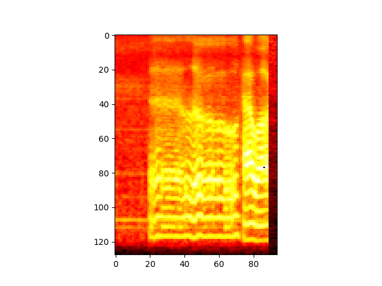

# CNN Audio Classification - watchOS inference

xcode_project contains a Swift 5 implementation of an application that records audio and makes class/activity predictions using the trained CNN model converted to CoreML .mlmodel format.

mel_basis_generator.py is used to generate a mel basis in order to save computation time when running on the watch. Its purpose is to scale the STFT created from raw audio to convert it to a mel spectrogram. This could otherwise be implemented as a one-time calculation within the WatchOS app that is run on start up.

json_plotter.py can be used to plot arrays created on the Apple Watch for testing purposes. In the xcode project (InterfaceController.swift) you will find two functions, saveJsonArray and saveJsonArray2D, which can be passed audio PCM arrays or melgram/STFT arrays for saving. These will be saved to the device or simulator's documents folder with the supplied name. If using the simulator, the documents directory will look something like the following: `⁨~/Mac HD⁩/Users⁩/Mac⁩/Library/Developer⁩/CoreSimulator⁩/Devices⁩/E4ACEDB3-B898-4E12-8696-BA3291E22125/data⁩ ▸ ⁨Containers/Data/Application/F8CEC24B-F372-48B5-8731-0164B6092C9A⁩/Document`. The first identifier is the ID of the simulator you are using, and the second is the ID of the application. An example of a melgram created on the watch:

The last few columns are a placeholder as I have not yet implemented zero-padding when calculating the STFT on the left and right edges, but still needed an array of the same height and width. This was not a big problem in testing whether or not the approach works because the CNN should have learned to find patterns.

Tested on a Series 4 Apple Watch running WatchOS 5.
